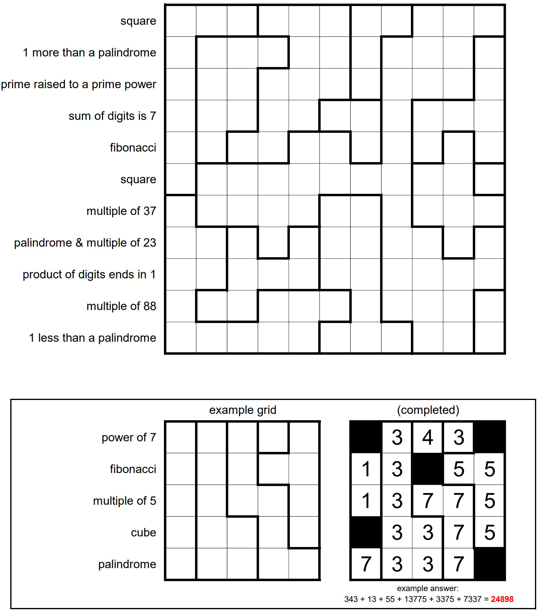

Number Cross 4

The 11-by-11 grid above has been divided into various regions. Shade some of the cells black, then place digits (0-9) into the remaining cells. Shading must be “sparse”: that is, no two shaded cells may share an edge.

Every cell within a region must contain the same digit, and orthogonally adjacent cells in different regions must have different digits. (Note that shading cells may break up regions or change which pairs of regions are adjacent. See the example, below.)

Each row has been supplied with a clue. Every number formed by concatenating consecutive groups of unshaded cells within a row must satisfy the clue given for the row. (As in the example.) Numbers must be at least two digits long and may not begin with a 0.

The answer to this month’s puzzle is the sum of all the numbers formed in the completed grid. (As in the example.)
